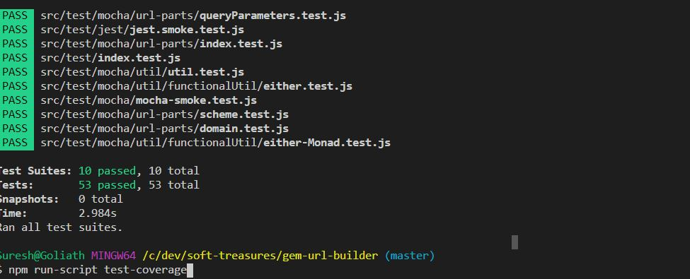

# gem-url-builder

This is an utility to build an url leveraging functional programming approaches

## Intended Usage

This is to show case a real life production pacake with all the bells and whistles

## Unit Tests

Includes unit tests see image

## Test Coverage

Includes unit tests with 90+ code coverage see image 

### Get Test Coverage Report

On the on the root folder run this command in the terminal see image 

> npm run-script test-coverage

## Environment Variables

![see (https://medium.com/dubizzletechblog/managing-environment-variables-in-nodejs-and-modern-js-apps-608003f4686c)

# JSDocs documentation

to generate JSDocs documentation use this command jsdoc src -r -d docs

NOTE JSDoc is required . (npm i jsdoc --save-dev)
